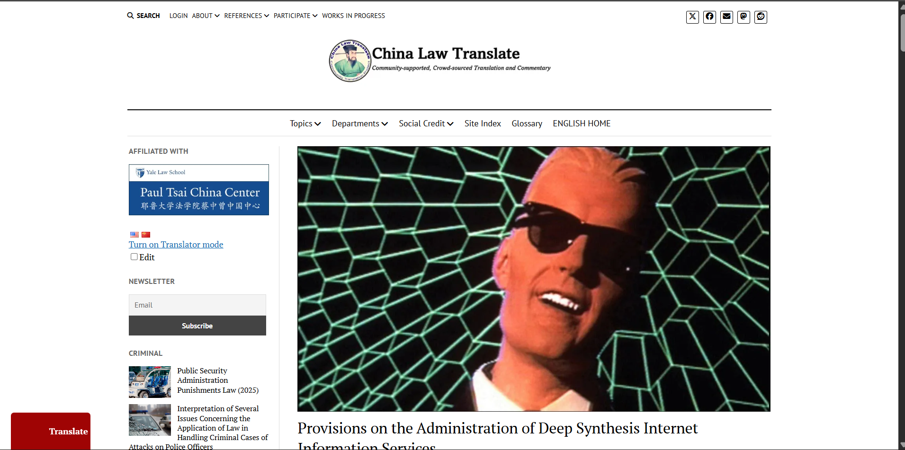

# China — Provisions on the Administration of Deep Synthesis of Internet-based Information Services

## Standard Profile
- **Domain:** Governance
- **Pack ID:** `gov-26-china-provisions-on-the-administration-of-deep-synthesis-of-internet-base-ab97302a`
- **Version:** `1.0`
- **Jurisdiction:** China
- **Type:** Regulation / measures

## Official Standard Link
- [China — Provisions on the Administration of Deep Synthesis of Internet-based Information Services](https://www.chinalawtranslate.com/en/deep-synthesis/)

## Website Screenshot

## Brief Info
Reference checklist pack for China — Provisions on the Administration of Deep Synthesis of Internet-based Information Services. Jurisdiction: China. Type: Regulation / measures.

## How This Is Used In TrustStack
This standard is represented as a versioned pack and contributes checklist controls, expected evidence, and audit-ready mapping context.
