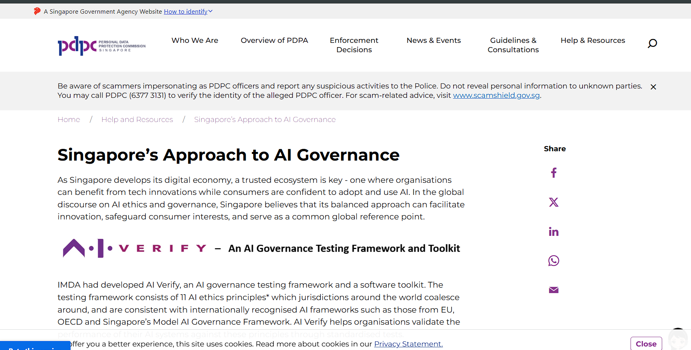

# Singapore — Model AI Governance Framework for Agentic AI

## Standard Profile
- **Domain:** Governance
- **Pack ID:** `gov-31-singapore-model-ai-governance-framework-for-agentic-ai`
- **Version:** `1.0`
- **Jurisdiction:** Singapore
- **Type:** Guidance framework

<!-- ## Official Standard Link
- [Singapore — Model AI Governance Framework for Agentic AI](https://www.pdpc.gov.sg/-/media/files/pdpc/pdf-files/resource-for-organisation/agentic-ai/20260122_model-ai-governance-framework-for-agentic-ai_final.pdf) -->

## Official Standard Link
- [Singapore — Model AI Governance Framework for Agentic AI](https://www.pdpc.gov.sg/help-and-resources/2020/01/model-ai-governance-framework)

## Website Screenshot

## Brief Info
Reference checklist pack for Singapore — Model AI Governance Framework for Agentic AI. Jurisdiction: Singapore. Type: Guidance framework.

## How This Is Used In TrustStack
This standard is represented as a versioned pack and contributes checklist controls, expected evidence, and audit-ready mapping context.
